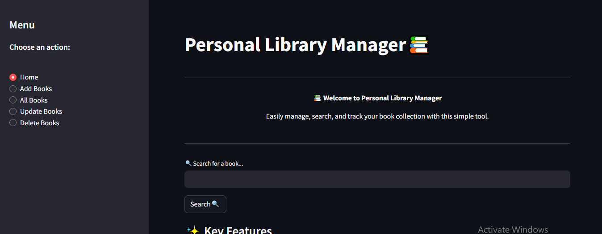

# 📚 Personal Library Manager

**A Streamlit-based library management application to organize your book collection with ease.**

## 🚀 Features
- 📖 **Add Books**: Store book details including title, author, publication year, genre, read status, and cover image.
- 🔍 **Search Books**: Quickly find books by title or author.
- 👀 **View Books**: Display all stored books with their details and cover images.
- ✏️ **Update Books**: Edit book information as needed.
- 🗑️ **Delete Books**: Remove books from the library, including their cover images.

## 🛠️ Tech Stack
- **Frontend**: [Streamlit](https://streamlit.io/) (Python-based UI framework)
- **Database**: SQLite (Lightweight database for storing book details)
- **Backend**: Python (Handles CRUD operations)

## 📂 Project Structure
```
📦 Personal_Library_Manager
├── 📂 covers          # Folder to store book cover images
├── 📜 main.py         # Streamlit app for UI and logic
├── 📜 database.py     # Handles database operations
├── 📜 library.db      # SQLite database file
├── 📜 README.md       # Project documentation
```

## 🏗️ Installation & Setup
1. **Clone the repository:**
   ```bash
   git clone https://github.com/yourusername/Personal_Library_Manager.git
   cd Personal_Library_Manager
   ```

2. **Install dependencies:**
   ```bash
   pip install streamlit sqlite3
   ```

3. **Run the application:**
   ```bash
   streamlit run main.py
   ```

## 📸 Screenshots


## 💡 Future Enhancements
- 📊 **Analytics Dashboard** to track reading trends
- 📤 **Export Books List** as CSV or PDF
- 🌐 **Cloud Integration** for remote access

## 🤝 Contributing
Contributions are welcome! Feel free to fork this project and submit a pull request.

## 📜 License
This project is licensed under the MIT License.

---
Made with ❤️ using Python & Streamlit

